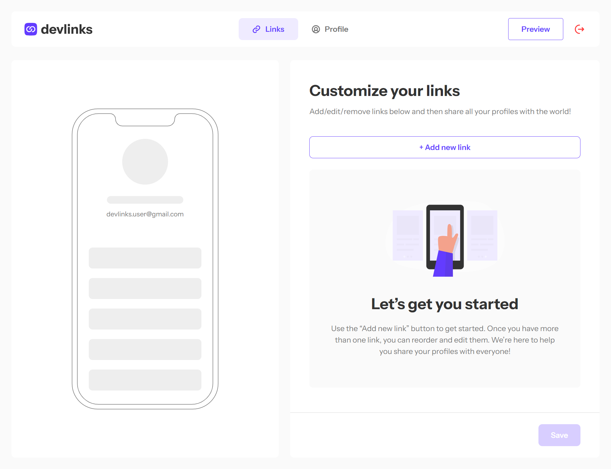
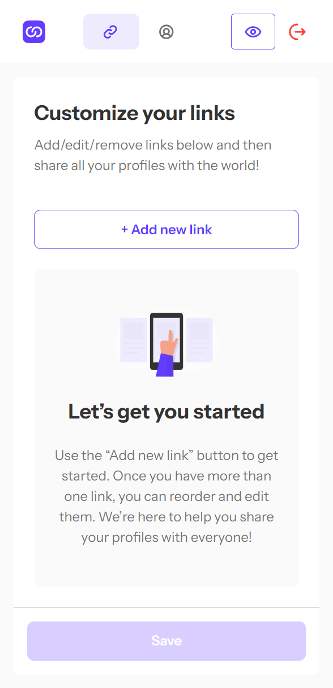

 
# Frontend Mentor - Link Sharing

This is a solution to the [Link-sharing app challenge on Frontend Mentor](https://www.frontendmentor.io/challenges/linksharing-app-Fbt7yweGsT). Frontend Mentor challenges help you improve your coding skills by building realistic projects. 


## Table of contents

- [Overview](#overview)
  - [The challenge](#the-challenge)
  - [Screenshot](#screenshot)
  - [Links](#links)
- [My process](#my-process)
  - [Built with](#built-with)
  - [What I learned](#what-i-learned)
  - [Continued development](#continued-development)
- [Installing the app](#running-the-app)
- [Author](#author)

## Overview

This challenge is all about the addition of the user's link that will be reflected on their own personal profile preview that is shareable for others to see. User can update their profile information as well so that the preview will always be updated.

### The challenge
Users should be able to:

- Create, read, update, delete links and see previews in the mobile mockup
- Receive validations if the links form is submitted without a URL or with the wrong URL pattern for the platform
- Drag and drop links to reorder them
- Add profile details like profile picture, first name, last name, and email
- Receive validations if the profile details form is saved with no first or last name
- Preview their devlinks profile and copy the link to their clipboard
- View the optimal layout for the interface depending on their device's screen size
- See hover and focus states for all interactive elements on the page
- **Bonus**: Save details to a database (build the project as a full-stack app)
- **Bonus**: Create an account and log in (add user authentication to the full-stack app)

### Screenshot




### Links

- Solution URL [Solution site](https://www.frontendmentor.io/solutions/link-sharing-app-nextjs-typescript-tailwind-RrwJFUT9uy)
- Live Site URL [Live site](https://link-sharing-devs.vercel.app/)

## My process

Hi!! Again, it's been a while since I've posted and created another project from FEM. Really felt doing one again for a long time.

This is my 27th project from [frontendmentor](https://www.frontendmentor.io/) and another long overdue one! I took this project way before when I have premium and only started after months of being idle from the platform. Also, I had a job after graduation so that's why I was unable to build projects again and yes, I had. So this time, I think I may be able again to continue building projects from FEM!

For this one, I used next.js as it is my go to stack when building apps. This is my 2nd time building using the app router which is really new to me and i'm still figuring out what is the best way to organized my files so excuse me if you think my codebase right now is a bit messy.

I initially planned to build this project for a much shorter days since there aren't really frames in the mockup where it could delay the progress, but yeah, I did it in a week and I think it could be improve. But again, speed is not everything because you need to make sure that everything is working and making it as accessible as you can.

I had a lot of thinking when building this one because of using the new stack and really wanted it to use the `pages` router but using the `app` router on this one is I think beneficial because it's a new thing that I learned and I think I will be using it for now.

### Built with

- Semantic HTML5 markup
- Next.js (App router)
- Typescript
- Tailwind
- tRPC
- Drizzle
- NextAuth
- MySql
- Framer-motion
- Zustand

### What I learned

#### Next.js (App Router)

App router is the new router that next.js introduced, I think it was present in Next 13 so yeah, I skipped it because I liked the `pages` router better and have built my structuring on top it. That is why, it was hard choice for me to use this style because I don't have any experience with it. But the time when I was building the app, I kind of liked it to be honest. Well the main reason I don't want to use it is that I can't use `styled-components` properly since it always needs to be client side.

##### Cool things I liked about the app router

`Layout` is really neat because I won't have to add extra fields to the component to insert the layout and conditional render it inside the `_app.tsx` in the `pages router`. All you need to do is just create a `layout.tsx` file on any folder that you want and it will automatically use that for its children. But, make sure that you control it properly because a `layout` that is defined in a parent folder will always wrap all the components or pages inside it.

```
parent
 layout.tsx = this will appear in all nested level below
 -> child
   -> grand child
     ->... . ..
```

`Server actions` are pretty cool as well. I think I only used one in here or maybe 2 but they're really good. Since I need to send an image file to the api and I can't really do that with `tRPC` now, well I could but I need to transform the file into other types like `base64` but I want to do it differently. That's how server actions comes in because I used `zod-form-data` to convert the form data into the native `FormData` and submit it to the server action and that is valid. From what I read, server actions are the ideal one when sending the data to the backend instead of creating a separate api for it, but I think will stick to just creating the api separately.

#### SQL

`SQL` is something that I really want to learn, either with orm or natively. I have used it previously with my work for over 2 months I think, but I did it with Laravel's `Eloquent` and this really lift all the hurdles but also leaning you away with how `sql` works natively. `Drizzle` is the orm I used and it is really close on how you write `sql` and that I think is really good because it is somehow wanting you to know the api itself while helping you and the best part is, fully typesafe!!


### Continued development

With this project finished, I know that I will continue building some projects using the same stack that I used on this one because I really liked using them in here.

Also I am planning to build different own projects so planning and designing those will have to be present and may take time. But still, I think I got plenty more of time now to build FEM projects.

Finishing this project is really nice but I need to make the codebase more structured and the code to be more concise and easy to read.

There are lots of thing I want to improve now, those are:

 - File structuring. Since app router introduces new way, I need to create a default way on how I write so that it will be much organized
 - Accessibility. I think I did well but not the best for this. There are things that I didn't handle like doing `aria-live` or maybe more accessible state and texts when elements are changing. Definitely will work on this.
 - SQL. Since there are lots of sql requirements for jobs, improving on this by knowing the language itself will be beneficial for me.


## Running the app

First is to clone this repository to your local machine. After cloning it, `cd` to the project folder and run:
```bash
npm install
```

Then head over to the `.env.example` and rename it to just `.env`. Inside the file, fill up all the fields with the proper values. Also for this project, I used [Free DB Tech](https://freedb.tech/) as my database hosting provider because I can't really find anything that is free with SQL. Time to go back to mongodb now hahaha.

Create the database on your end as well.

After filling this up, run the commands below in order:

```bash
 npm run db:generate
 npm run db:push
```

Those are the commands that drizzle uses in order to create the migrations and push it to the database.

Lastly, just run:
  
```bash
npm  run  dev
# or
yarn  dev
```
Open [http://localhost:3000](http://localhost:3000) with your browser to see the result and have a try!


Thank you!

## Author

- Website - [My portfolio which I proudly built :>](https://pikamart.vercel.app/)
- Frontend Mentor - [@pikapikamart](https://www.frontendmentor.io/profile/pikapikamart)
- Twitter - [@RaymartPamplona](https://twitter.com/RaymartPamplona)